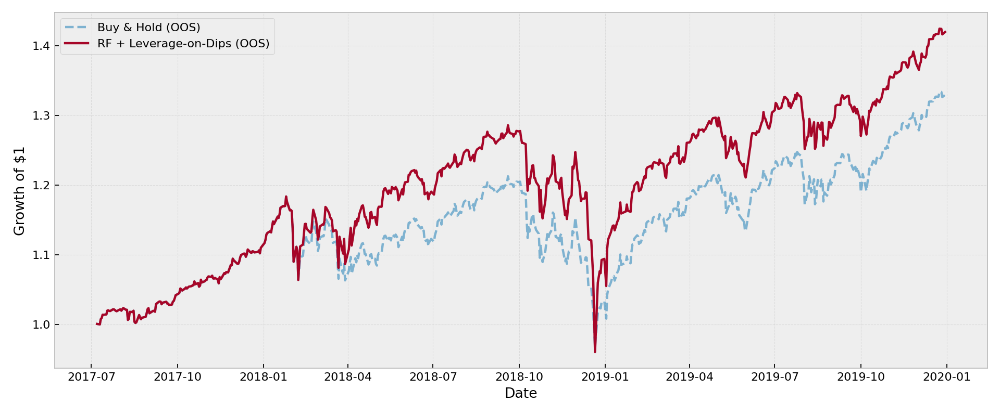
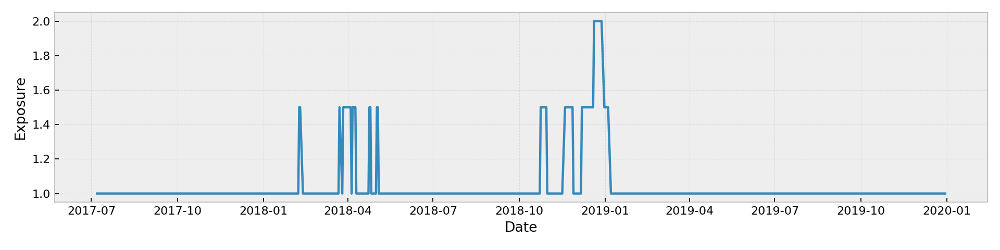

# Trading SPY Using Machine Learning and Leverage


This repo contains a small research project where I test a machine-learning–based trading strategy on SPY.  
The idea is to use a simple classifier to adjust market exposure, rather than trying to predict prices directly.

The focus is on clean out-of-sample testing and understanding when (and why) the strategy works.

---

## Idea

The strategy is built around three points:

- Stay fully invested most of the time (1.0× exposure).
- Use an ML model to estimate the probability of the market going up the next day.
- Add leverage only during drawdowns, when a rebound looks more likely.

Everything is tested using walk-forward validation to avoid look-ahead bias.

---

## Data

- Asset: SPY (daily data)
- Source: Yahoo Finance
- Date range controlled in the script

Prices are converted to returns and normalized features to reduce non-stationarity.

---

## Features

The model uses a small set of intuitive indicators:

- Momentum: RSI(14), ROC(10), ROC(30), compressed into one PCA factor
- Volatility: 20-day realized volatility (z-scored per training window)
- Trend: distance from the 50-day moving average
- Drawdown: distance from the rolling 1-year peak

All transformations are fit on training data only in each walk-forward split.

---

## Model

- Random Forest classifier (scikit-learn)
- Conservative settings to limit overfitting
- Target: whether the next day’s return is positive

The output is treated as a probability, not a hard trading signal.

---

## Exposure and Leverage

- Base exposure is always 1.0× (fully invested).
- Extra leverage is added only when:
  - The market is in a drawdown, and
  - The model assigns a high probability to an upward move.

Total exposure is capped, and simple transaction costs are applied when exposure changes.

---

## Validation

- Walk-forward cross-validation using `TimeSeriesSplit`
- Metrics reported per fold:
  - Train vs test accuracy
  - Sharpe ratio
  - Maximum drawdown
  - Average exposure
  - Fraction of leveraged days

Out-of-sample equity curves are stitched together across folds.

---

## Output

The script prints fold-level diagnostics and an average summary across folds, including feature importance.  
This makes it easy to see whether performance is stable across time or driven by specific regimes.

---
## Example Results

**Out-of-sample equity curve**


**Model-driven exposure over time**


## Dependencies

```bash
pip install yfinance scikit-learn pandas numpy matplotlib
